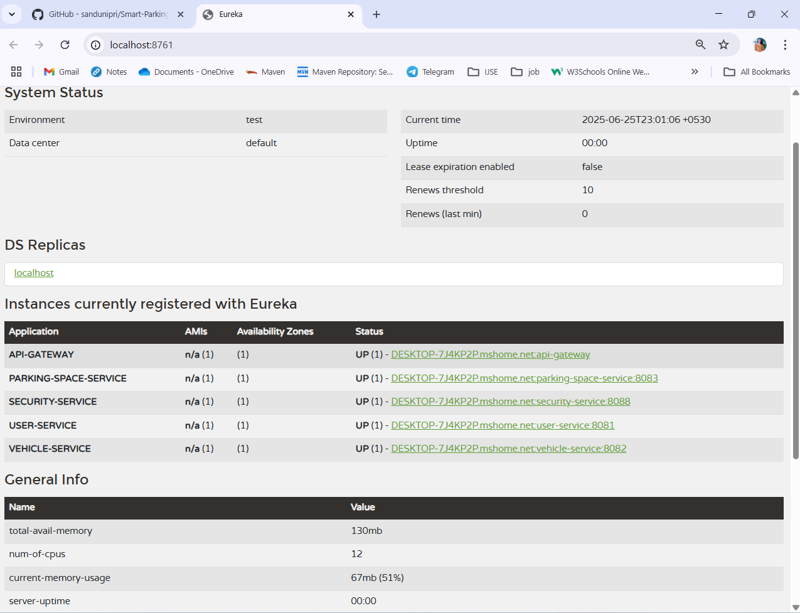

# Smart Parking Management System

A microservices-based Smart Parking Management System built with Spring Boot and Spring Cloud. The platform handles user authentication, vehicle management, parking space availability, and reservation tracking. It incorporates Eureka for service discovery and a centralized API Gateway for request routing and security enforcement.

## Project Structure

- `eureka-server/` – Eureka service registry
- `config-server/` – Centralized configuration service
- `security-service/` – Manages authentication and authorization (JWT-based)
- `api-gateway/` – Central gateway for routing and securing API requests
- `user-service/` – Manages user registration, authentication, and user roles
- `vehicle-service/` – Manages vehicle records associated with registered users
- `parking-space-service/` – Manages available parking slots and related information
- `parking-reservation-service/` – Handles parking reservations, active sessions, and reservation history
- `docs/screenshots/` – Contains documentation assets and screenshots

## Technologies Used

- Java 17
- Spring Boot
- Spring Cloud (Eureka, Config Server, OpenFeign)
- Spring Security with JWT
- MySQL
- API Gateway
- Postman
- Maven
- Git, GitHub

## Configuration Management

This project uses centralized configuration management via **Spring Cloud Config Server**. All service configurations are maintained in a separate Git-based repository:

- Repository Name: `SPMS-config-repo`
- Repository Link:
  ```bash
  git clone https://github.com/sandunipri/SPMS-Config-Repo.git
  
Each microservice retrieves its configuration at startup from this external repository.

## Resources

- [Postman Request](./smart-parking-system.postman_collection.json)

## Eureka Dashboard

- 

## Port Running

- 
